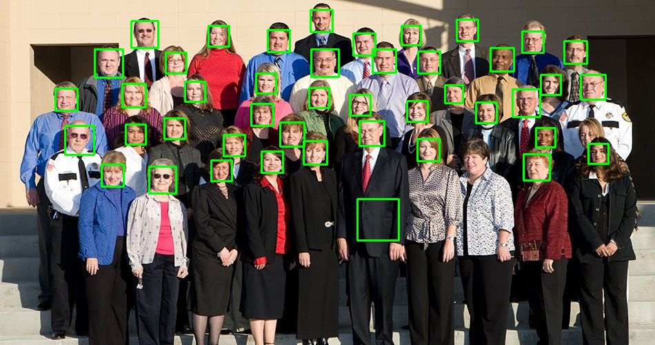

# Live Face Detection using OpenCV library only

Use of OpenCV only to detect different faces in various images as well as from live capture from Webcam.

### Sample Input: 

### Ouput with detected faces: 

## Libraries Used : 
1. OpenCV 4.5.1 
